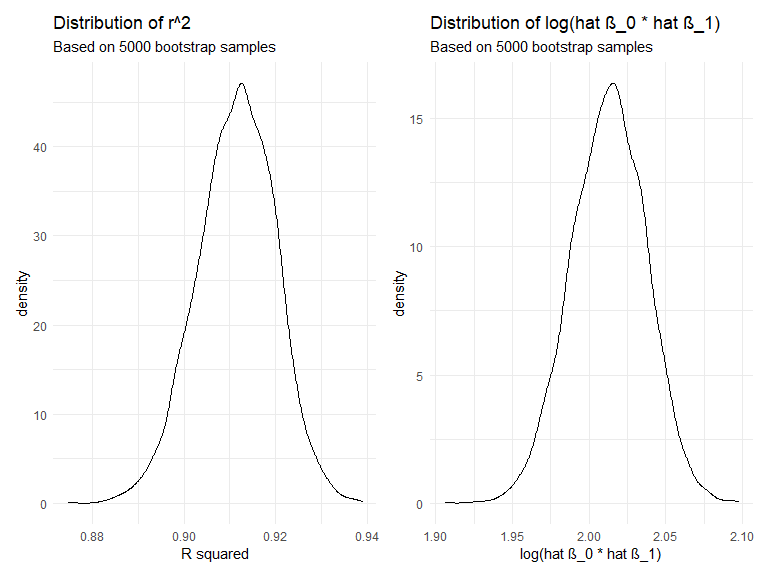

P8105 Homework 6
================
Ruiyang Li
2020-12-06

This is my solution to HW6.

### Problem 1

``` r
homicide_df = 
  read_csv("data/homicide-data.csv", na = c("", "NA", "Unknown")) %>% 
  mutate(
    city_state = str_c(city, state, sep = ", "),
    victim_age = as.numeric(victim_age),
    resolution = case_when(
      disposition == "Closed without arrest" ~ 0,
      disposition == "Open/No arrest"        ~ 0,
      disposition == "Closed by arrest"      ~ 1)
  ) %>% 
  filter(
    victim_race %in% c("White", "Black"),
    city_state != "Tulsa, AL") %>% 
  dplyr::select(city_state, resolution, victim_age, victim_race, victim_sex)
## Parsed with column specification:
## cols(
##   uid = col_character(),
##   reported_date = col_double(),
##   victim_last = col_character(),
##   victim_first = col_character(),
##   victim_race = col_character(),
##   victim_age = col_double(),
##   victim_sex = col_character(),
##   city = col_character(),
##   state = col_character(),
##   lat = col_double(),
##   lon = col_double(),
##   disposition = col_character()
## )
```

Start with one city: Baltimore, MD.

``` r
baltimore_df =
  homicide_df %>% 
  filter(city_state == "Baltimore, MD")

glm(resolution ~ victim_age + victim_race + victim_sex, 
    data = baltimore_df,
    family = binomial()) %>% 
  broom::tidy() %>% 
  mutate(
    OR = exp(estimate),
    CI_lower = exp(estimate - 1.96 * std.error),
    CI_upper = exp(estimate + 1.96 * std.error)
  ) %>% 
  dplyr::select(term, OR, starts_with("CI")) %>% 
  knitr::kable(digits = 3)
```

| term              |    OR | CI\_lower | CI\_upper |
| :---------------- | ----: | --------: | --------: |
| (Intercept)       | 1.363 |     0.975 |     1.907 |
| victim\_age       | 0.993 |     0.987 |     1.000 |
| victim\_raceWhite | 2.320 |     1.648 |     3.268 |
| victim\_sexMale   | 0.426 |     0.325 |     0.558 |

Try this across cities.

``` r
models_results_df = 
  homicide_df %>% 
  nest(data = -city_state) %>% 
  mutate(
    models = 
      map(.x = data, ~glm(resolution ~ victim_age + victim_race + victim_sex, data = .x, family = binomial())),
    results = map(models, broom::tidy)
  ) %>% 
  dplyr::select(city_state, results) %>% 
  unnest(results) %>% 
  mutate(
    OR = exp(estimate),
    CI_lower = exp(estimate - 1.96 * std.error),
    CI_upper = exp(estimate + 1.96 * std.error)
  ) %>% 
  dplyr::select(city_state, term, OR, starts_with("CI")) 
```

Create a plot that shows the estimated ORs and CIs for each city.

``` r
models_results_df %>% 
  filter(term == "victim_sexMale") %>% 
  mutate(city_state = fct_reorder(city_state, OR)) %>% 
  ggplot(aes(x = city_state, y = OR)) + 
  geom_point() + 
  geom_errorbar(aes(ymin = CI_lower, ymax = CI_upper)) + 
  theme(axis.text.x = element_text(angle = 90, hjust = 1))
```


## Problem 2

Load and clean the data for regression analysis.

  - Convert numeric *factor* variables back to factor.
  - There is no missing data observed.

<!-- end list -->

``` r
# load and clean data
baby_df = 
  read_csv("./data/birthweight.csv") %>% 
  mutate(
    babysex = factor(babysex), 
    frace = factor(frace), 
    malform = factor(malform), 
    mrace = factor(mrace)
    )
## Parsed with column specification:
## cols(
##   .default = col_double()
## )
## See spec(...) for full column specifications.

# check missing values
baby_df %>%  summarise(na_count = sum(is.na(.))) # total # of na's
## # A tibble: 1 x 1
##   na_count
##      <int>
## 1        0
```

Propose a regression model for birthweight.

  - We can use step-wise selection procedure to select our regression
    model.
  - The step-wise selection procedure iteratively adds and/or removes
    important predictor based on AIC score.
  - Based on the results from step-wise selection, my proposed model is:
    `bwt` = `β_0` + `β_1` `babysex2` + `β_2` `bhead` + `β_3` `blength` +
    `β_4` `delwt` + `β_5` `fincome` + `β_6` `gaweeks` + `β_7` `mheight`
    + `β_8` `mrace2` + `β_9` `mrace3` + `β_10` `mrace4` + `β_11`
    `parity` + `β_12` `ppwt` + `β_13` `smoken`

<!-- end list -->

``` r
# fit the full model 
full_mod = lm(bwt ~ ., data = baby_df)

# stepwise regression model
step_mod = stepAIC(full_mod, direction = "both", trace = F)
step_mod %>% broom::tidy()
## # A tibble: 14 x 5
##    term         estimate std.error statistic   p.value
##    <chr>           <dbl>     <dbl>     <dbl>     <dbl>
##  1 (Intercept) -6099.      138.       -44.3  0.       
##  2 babysex2       28.6       8.45       3.38 7.37e-  4
##  3 bhead         131.        3.45      37.9  3.10e-272
##  4 blength        74.9       2.02      37.1  4.29e-262
##  5 delwt           4.11      0.392     10.5  2.26e- 25
##  6 fincome         0.318     0.175      1.82 6.88e-  2
##  7 gaweeks        11.6       1.46       7.93 2.79e- 15
##  8 mheight         6.59      1.78       3.69 2.23e-  4
##  9 mrace2       -139.        9.91     -14.0  1.21e- 43
## 10 mrace3        -74.9      42.3       -1.77 7.68e-  2
## 11 mrace4       -101.       19.3       -5.21 1.98e-  7
## 12 parity         96.3      40.3        2.39 1.70e-  2
## 13 ppwt           -2.68      0.427     -6.26 4.20e- 10
## 14 smoken         -4.84      0.586     -8.27 1.75e- 16

# selected model 
step_mod$call
## lm(formula = bwt ~ babysex + bhead + blength + delwt + fincome + 
##     gaweeks + mheight + mrace + parity + ppwt + smoken, data = baby_df)
step_mod$anova
## Stepwise Model Path 
## Analysis of Deviance Table
## 
## Initial Model:
## bwt ~ babysex + bhead + blength + delwt + fincome + frace + gaweeks + 
##     malform + menarche + mheight + momage + mrace + parity + 
##     pnumlbw + pnumsga + ppbmi + ppwt + smoken + wtgain
## 
## Final Model:
## bwt ~ babysex + bhead + blength + delwt + fincome + gaweeks + 
##     mheight + mrace + parity + ppwt + smoken
## 
## 
##         Step Df   Deviance Resid. Df Resid. Dev      AIC
## 1                               4320  320724338 48717.83
## 2   - wtgain  0      0.000      4320  320724338 48717.83
## 3  - pnumsga  0      0.000      4320  320724338 48717.83
## 4  - pnumlbw  0      0.000      4320  320724338 48717.83
## 5    - frace  4 124365.432      4324  320848704 48711.51
## 6  - malform  1   1447.241      4325  320850151 48709.53
## 7    - ppbmi  1   6928.376      4326  320857079 48707.63
## 8   - momage  1  29211.120      4327  320886290 48706.02
## 9 - menarche  1 100121.331      4328  320986412 48705.38
```

  - Below is the plot of model residuals vs. fitted values.

<!-- end list -->

``` r
# fit selected model 
fit = lm(bwt ~ babysex + bhead + blength + delwt + fincome + gaweeks + mheight + mrace + parity + ppwt + smoken, 
         data = baby_df)
  
# plot resid vs. pred
baby_df %>% 
  add_predictions(fit) %>% 
  add_residuals(fit) %>% 
  ggplot(aes(y = resid, x = pred)) + 
  geom_point(alpha = .2) + 
  labs(
    title = "Plot of model residuals vs. fitted values",
    subtitle = "Stepwise model",
    x = "Fitted Values",
    y = "Residuals"
  )
```


Compare the selected model to

  - Main effect model: using length at birth and gestational age as
    predictors
  - Interaction model: using head circumference, length, sex, and all
    interactions as predictors

Results:

  - From the violin plot below, we can see that our selected model
    performed the best among the three models as it has the lowest rmse.
  - The interaction model performed the second best.
  - The main effect model performed the worst among the three.

<!-- end list -->

``` r
# get cv training and testing datasets
set.seed(20201209)
cv_df = 
  crossv_mc(baby_df, 100) %>% 
  mutate(
    train = map(train, as_tibble),
    test = map(test, as_tibble)
  )

# fit models and get RMSEs
cv_df = 
  cv_df %>% 
  mutate(
    main_mod = map(.x = train, ~lm(bwt ~ blength + gaweeks, data = .x)),
    fit_mod = map(.x = train, 
                  ~lm(bwt ~ babysex + bhead + blength + delwt + fincome +
                        gaweeks + mheight + mrace + parity + ppwt + smoken, 
                      data = .x)),
    int_mod = map(.x = train, ~lm(bwt ~ bhead:blength:babysex, data = .x))
  ) %>% 
  mutate(
    rmse_main = map2_dbl(.x = main_mod, .y = test, ~rmse(model = .x, data = .y)),
    rmse_fit = map2_dbl(.x = fit_mod, .y = test, ~rmse(model = .x, data = .y)),
    rmse_int = map2_dbl(.x = int_mod, .y = test, ~rmse(model = .x, data = .y))
  )

# compare models in terms of the cv prediction error (rmse)
cv_df %>% 
  dplyr::select(starts_with("rmse")) %>% 
  pivot_longer(
    everything(),
    names_to = "model",
    values_to = "rmse",
    names_prefix = "rmse_"
  ) %>% 
  ggplot(aes(x = model, y = rmse)) +
  geom_violin() + 
  labs(
    title = "Violin plot",
    subtitle = "fit: step-wise model; int: interaction model; main: main effect model")
```


## Problem 3

Download data.

``` r
weather_df = 
  rnoaa::meteo_pull_monitors(
    c("USW00094728"),
    var = c("PRCP", "TMIN", "TMAX"), 
    date_min = "2017-01-01",
    date_max = "2017-12-31") %>%
  mutate(
    name = recode(id, USW00094728 = "CentralPark_NY"),
    tmin = tmin / 10,
    tmax = tmax / 10) %>%
  dplyr::select(name, id, everything())
## Registered S3 method overwritten by 'hoardr':
##   method           from
##   print.cache_info httr
## using cached file: C:\Users\rache\AppData\Local\Cache/R/noaa_ghcnd/USW00094728.dly
## date created (size, mb): 2020-09-11 20:45:56 (7.533)
## file min/max dates: 1869-01-01 / 2020-09-30
```

Regression of interest:

  - tmax = β\_0 + β\_1 tmin

Goal:

  - To use 5000 bootstrap samples to learn about the distribution of r^2
    and log(hat β\_0 ∗ hat β\_1)

For each bootstrap sample, produce estimates of these two quantities.

``` r
# create 5000 bootstrap samples
set.seed(20201209)
bootstrap_rslt = 
  weather_df %>% 
  bootstrap(5000, id = "strap_number") %>% 
  mutate(
    models = map(.x = strap, ~lm(tmax ~ tmin, data = .x)), 
    r_squared = map(models, broom::glance),
    results = map(models, broom::tidy)
  )

# produce estimates of r^2 + log(\hat(\beta_0) * \hat(\beta_1))
bootstrap_est = 
  bootstrap_rslt %>% 
  dplyr::select(strap_number, r_squared, results) %>% 
  unnest(r_squared) %>% 
  dplyr::select(strap_number, r.squared, results) %>% 
  unnest(results) %>% 
  janitor::clean_names() %>%  
  dplyr::select(strap_number, r_squared, term, estimate) %>% 
  pivot_wider(
    names_from = term, 
    values_from = estimate
  ) %>% 
  rename(beta_0 = `(Intercept)`, beta_1 = tmin) %>% 
  mutate(log_beta0beta1 = log(beta_0 * beta_1)) %>% 
  dplyr::select(-starts_with("beta_"))

head(bootstrap_est)
## # A tibble: 6 x 3
##   strap_number r_squared log_beta0beta1
##   <chr>            <dbl>          <dbl>
## 1 0001             0.907           2.00
## 2 0002             0.916           1.98
## 3 0003             0.905           2.04
## 4 0004             0.910           2.03
## 5 0005             0.921           2.01
## 6 0006             0.906           1.97
```

Plot the distribution of these estimates.

  - r^2 has a bell-shaped distribution, with mean at 0.911. It ranges
    from 0.875 to 0.939
  - log(hat β\_0 ∗ hat β\_1) also has a bell-shaped distribution, with
    mean at 2.013. It ranges from 1.906 to 2.098.

<!-- end list -->

``` r
# plot distribution of r^2
r2_distn = 
  bootstrap_est %>% 
  ggplot(aes(x = r_squared)) + 
  geom_density() + 
  labs(
    title = "Distribution of r^2",
    subtitle = "Based on 5000 bootstrap samples", 
    x = "R squared")

# plot distribution of log(\hat(\beta_0) * \hat(\beta_1))
log_distn = 
  bootstrap_est %>% 
  ggplot(aes(x = log_beta0beta1)) + 
  geom_density() + 
  labs(
    title = "Distribution of log(hat β_0 ∗ hat β_1)",
    subtitle = "Based on 5000 bootstrap samples", 
    x = "log(hat β_0 ∗ hat β_1)")

r2_distn + log_distn
```



Using these 5000 estimates, identify the 2.5% and 97.5% quantiles to
provide a 95% confidence interval for r^2 and log(hat β\_0 ∗ hat β\_1).

  - The 95% confidence interval for r^2 is (0.894, 0.927).
  - The 95% confidence interval for log(hat β\_0 ∗ hat β\_1) is (1.965,
    2.059).

<!-- end list -->

``` r
# construct bootstrap CI
bootstrap_est %>% 
  dplyr::summarize(
    r2_ci_lower = quantile(r_squared, 0.025),
    r2_ci_upper = quantile(r_squared, 0.975), 
    log_ci_lower = quantile(log_beta0beta1, 0.025),
    log_ci_upper = quantile(log_beta0beta1, 0.975)
  ) %>% 
  knitr::kable(digits = 3) 
```

| r2\_ci\_lower | r2\_ci\_upper | log\_ci\_lower | log\_ci\_upper |
| ------------: | ------------: | -------------: | -------------: |
|         0.894 |         0.927 |          1.964 |          2.059 |
